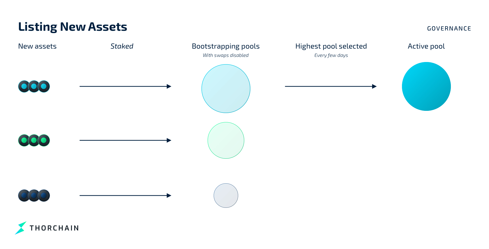

# Governance

THORChain aims to have as little governance baked into the system as possible. This is done so that nodes don't communicate or learn who one another are. This is important for security because it makes sure that nodes don't act together to take control.

THORChain governance decides:

* which assets are listed/delisted
* which chains are listed/delisted
* when the protocol gets upgraded
* the economic limit – how many nodes can participate

### Asset Listing

Users signal which assets they want on the network by staking in a new pool. THORChain will realise it is a new asset it hasn't been seen before and create a new pool and place it in bootstrap mode. This is a normal asset pool except swapping is disabled on it. Every few days the networks looks at all the bootstrapping pools and lists the one with the highest value.

### Asset Delisting

Assets are delisted when all liquidity providers have taken all their assets out of it, or its pool depth drops too low. The logic is:

1. When a new bootstrap pool is enabled, its depth is compared with the depth of the smallest active pools. 
2. If it is deeper, the smallest active pool is placed back into bootstrap mode, and the new pool replaces it. 

The process is repeated to re-list an asset.

## Chain Listing/Delisting

When the community wants to support a new chain

1. Community developers write a new Bifröst module and propose it via a [THORChain Improvement Proposal \(TIP\)](governance.md#protocol-upgrades-and-thorchain-improvement-proposals-tips)
2. THORChain developer community decides whether or not to approve it
3. If approved, the code gets tested and validated by core developers
4. If accepted, it gets added to THORNode software
5. Nodes upgrade their software as they are cycled off and back onto the network
6. When 67% of nodes are running the new software, the new chain is connected

To delist, nodes stop watching a chain. When 67% are no longer watching, it gets removed. A process begins and the assets of that chain are returned to their owners.

## Protocol Upgrades & THORChain Improvement Proposals \(TIPs\)

Developers from the community submit THORChain Improvement Proposals \(TIPs\) to improve the network. The community discusses, tests and validates the software. If they decide that the change is beneficial, it's merged into the THORNode software.

The protocol is made up of 3 main pieces, run by the nodes:

* application logic – runs the blockchain
* schema – stores key values of vaults
* network software – keeps the TSS protocol key generation and signing

When nodes are churned off the network they can choose to update their software version. Over time more and more nodes will run the latest version. When 67% of nodes are running the new software, the network is automatically updated. This is how application logic, chain connections and schema are updated.

When upgrading the network software, a certain block number in the future is set when the upgrade will happen. When the network reaches that point, the whole chain stops running and a genesis import to a new network occurs and operations continue normally.

### Emergency Changes

Emergency changes are difficult to coordinate because nodes cannot communicate. To handle an emergency, nodes should leave the system. When the number of nodes falls below 4, funds are paid out and the system can be shut-down. This process is called Ragnarök.

## Economic Limit

There are only so many nodes who can participate on the network. This is because there's a minimum bond amount and a fixed supply of Rune. If the system is ever found to be always under-bonded or over-bonded, the minimum bond limit can be changed. 

## Mimir

Mimir is a feature to allow admins to change constants in the chain, such as MinimumBond, ChurnSpeed and more during Chaosnet. When Mimir is destroyed, the chain will be uncapped and in Mainnet. 

