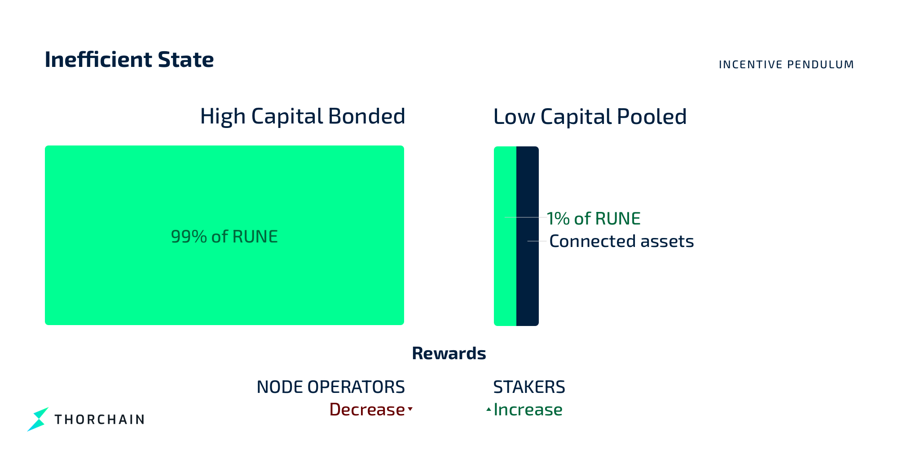

# Incentive Pendulum

The capital on THORChain can lose its balance over time. Sometimes there will be too much capital in liquidity pools; sometimes there will be too much bonded by nodes. If there is too much capital in liquidity pools, the network is unsafe. If there is too much capital bonded by nodes, the network is inefficient.

If the network becomes unsafe, it increases rewards for node operators and reduces rewards for liquidity providers. If the network becomes inefficient, it boosts rewards for liquidity providers and reduces rewards for node operators.

## Balancing System States

THORChain can be in 1 of 5 main states—

* Unsafe
* Under-Bonded
* Optimal
* Over-Bonded
* Inefficient

These different states can be seen in the relationship between bonded Rune and pooled Rune. The amount of Rune which has been bonded by node operators, and the amount which has been added to liquidity pools by liquidity providers.

### Optimal State

In the optimal state, bonded capital is roughly equal to pooled capital. Bonded capital is 100% Rune; pooled capital half Rune and half external assets.

67% of Rune in the system is bonded and 33% is pooled. This is the desired state. The system makes no changes to the incentives for node operators or liquidity providers.

### Unsafe State

The system may become unsafe. In this case, pooled capital is higher than bonded capital. Pooled Rune is now equal to bonded Rune – a 50/50 split.

This is undesirable because it means that it's become profitable for node operators to work together to steal assets.

To fix this, the system increases the amount of rewards going to node operators and lowers the rewards going to liquidity providers. This leads to more node operators getting involved, bonding more Rune and increasing bonded capital. This also disincentivises liquidity providers from taking part. They receive less return on their investment, so they pull assets out and reduce the amount of pooled capital. With time, this restores balance and the system moves back towards the optimal state.

### Inefficient State

The system can also become inefficient. In this case, pooled capital would be much lower in value than bonded capital. This is a problem because it means that much more capital is being put into securing pooled assets than those assets are actually worth.

To fix this, the system increases rewards for liquidity providers and decreases rewards for node operators. This attracts more liquidity providers to the system, and fewer node operators. Liquidity providers add more capital to receive more rewards, increasing pooled capital. Some node operators remove their bonded Rune, seeking more profitable places to put their capital. Bonded capital falls.\
In this way, the system returns to the optimal state.

### Under and Over-Bonded States

The under- and over-bonded states are less severe intermediary states. Being under-bonded is not a threat in itself because it is not yet profitable for node operators to steal. Being over-bonded is not a problem in itself because the system is still operating quite well.

The THORChain team does not expect the unsafe or inefficient states to come up often. The system will be in the over-bonded state most of the time, particularly as it gets easier for people to run nodes.


Try this [interactive model](https://rebase.foundation/network/thorchain/system-component/balancer) of the Incentive Pendulum.


## Algorithm

The algorithm that controls the Incentive Pendulum is as follows:

$$
shareFactor = \frac{b - s}{b + s / ic}
$$

$$
b = totalBonded, s = totalPooled, ic = Incentive Curve
$$

Incentive Curve is taken from constants however can be overridden in Mimir.

In the stable situation of 67m RUNE bonded and 33m RUNE pooled:

$$
shareFactor = \frac{67 -  33}{67 + 33/100} = 0.5
$$

Node Operators and Liquidity providers will share the rewards equally. While Liquidity providers provide 33% of Rune (totalPooled) they will be paid 50% of the rewards as they provide 50% of liquidity (RUNE and Asset). An Incentive Curve of 100 ensures this.&#x20;

In an under-bonded situation of 60m RUNE Bonded and 40m RUNE pooled:&#x20;

$$
shareFactor = \frac{60 -  40}{60  + 40/2} = 0.25
$$

Thus, 75% of rewards will go to Node Operators and 25% to Liquidity providers.&#x20;

In a more under-bonded situation, the Incentive Curve is be increased to provide more rewards to Liquidity providers as they might leave if rewards are too low. An Incentive Curve of 2 would produce 0.12.

$$
shareFactor = \frac{55 -  45}{55  + 45/4} = 0.15
$$

#### Incentive Curve

The Incentive Curve can be used to ensure Node Operators are not being too much in a stable situation or over-bonded situation and reduce rewards to Liquidity providers in an under-bonded situation. Increasing rewards in an under-bonded situation may be done to retain Liquidity providers.&#x20;

Reducing the Incentive Curve will reduce rewards to liquidity providers and increasing it will give liquidity providers more rewards, given the same `totalBonded` and `totalPooled`numbers. While it influences rewards, it is still bound by the Incentive Pendulum.

## Driving Capital Allocation

As a by-product of the Incentive Pendulum's aggressive re-targeting of 67:33 split of BONDED:POOLED RUNE, it means that in an equilibrium, the value of BONDED RUNE will always be double the value of POOLED RUNE. Since POOLED RUNE is 1:1 bonded with POOLED Capital (due to liquidity pools), then the total market value of RUNE is targeted to be 3 times the value of pooled assets.

If there is any disruption to this, then it means capital will be re-allocated by Nodes and Liquidity providers to pursue maximum yield, and thus correct the imbalance.
